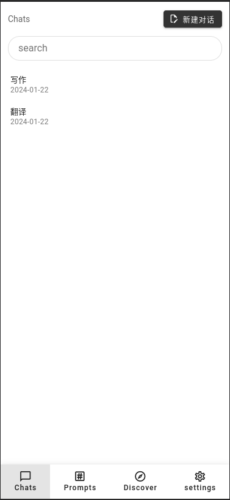
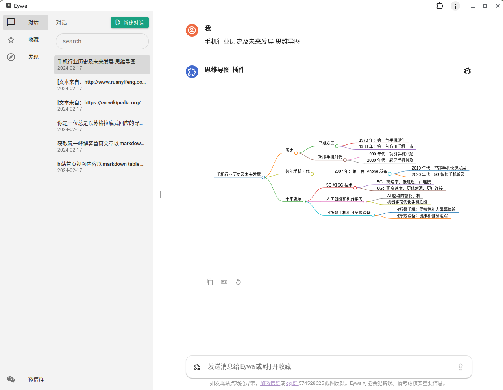
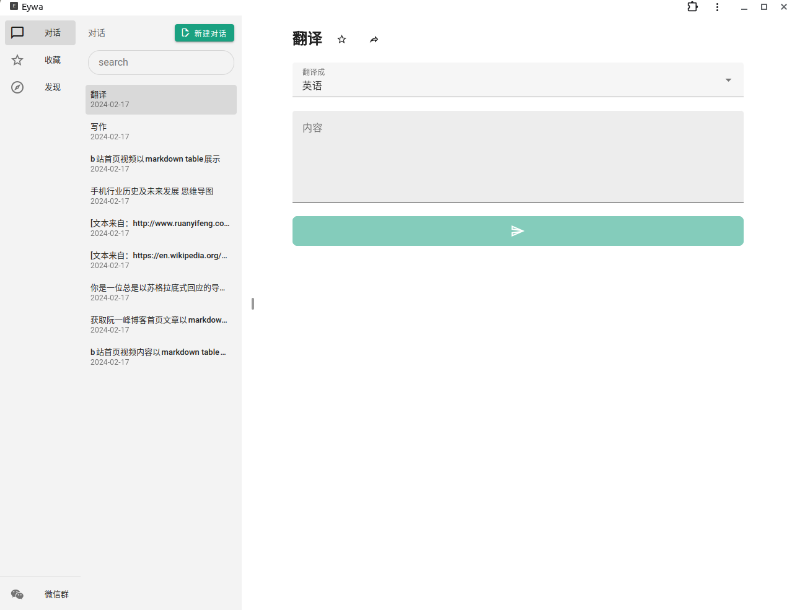
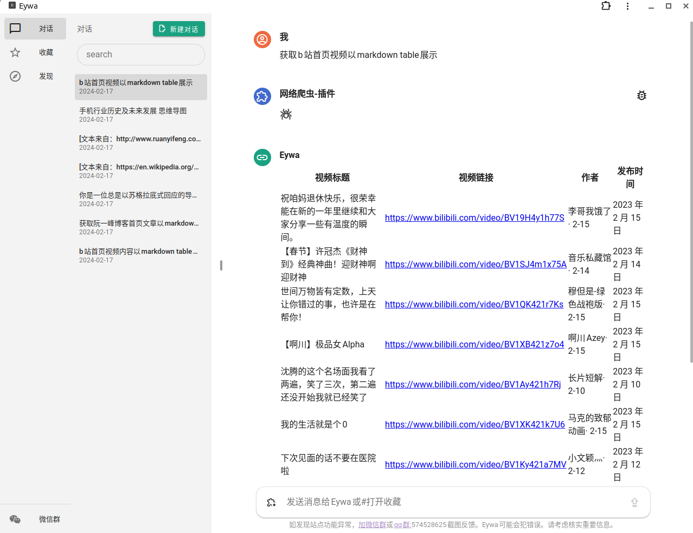
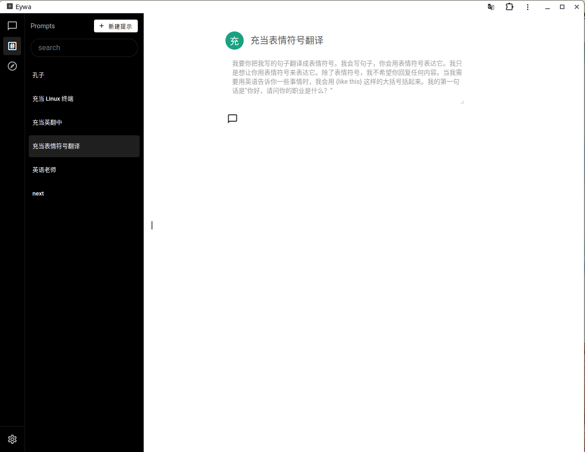
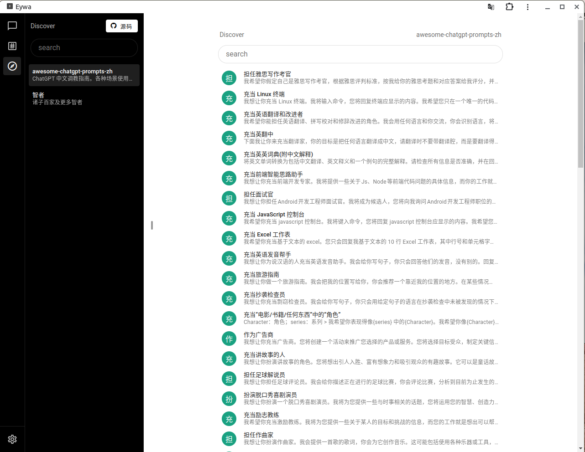

# Eywa（伊娃）

> 基于 llm，all chat one ui，源于阿凡达中潘罗拉星球的 eywa, 寓意链接更多智慧与知识，或虚拟人

[大模型应用层爱好者群](https://zhidayingxiao.cn/to/06g6xX)

[在线预览](https://1e1.fun)

[在线预览](https://1e1.fun)

## 功能

- [x] chat gui support mobile （大模型的能力以对话的形式呈现，在这里开启交互）

- [x] pwa (支持断网访问)

- [x] x-prompts support prompt gui (给提示词一个友好的交互界面)

- [x] prompts expore (发现 prompts , 源自网聚人的力量)

- [x] more LLM API (gemini pro, chat gpt，更多等待添加)

## 私有化部署

Deploy With Vercel

## 界面

